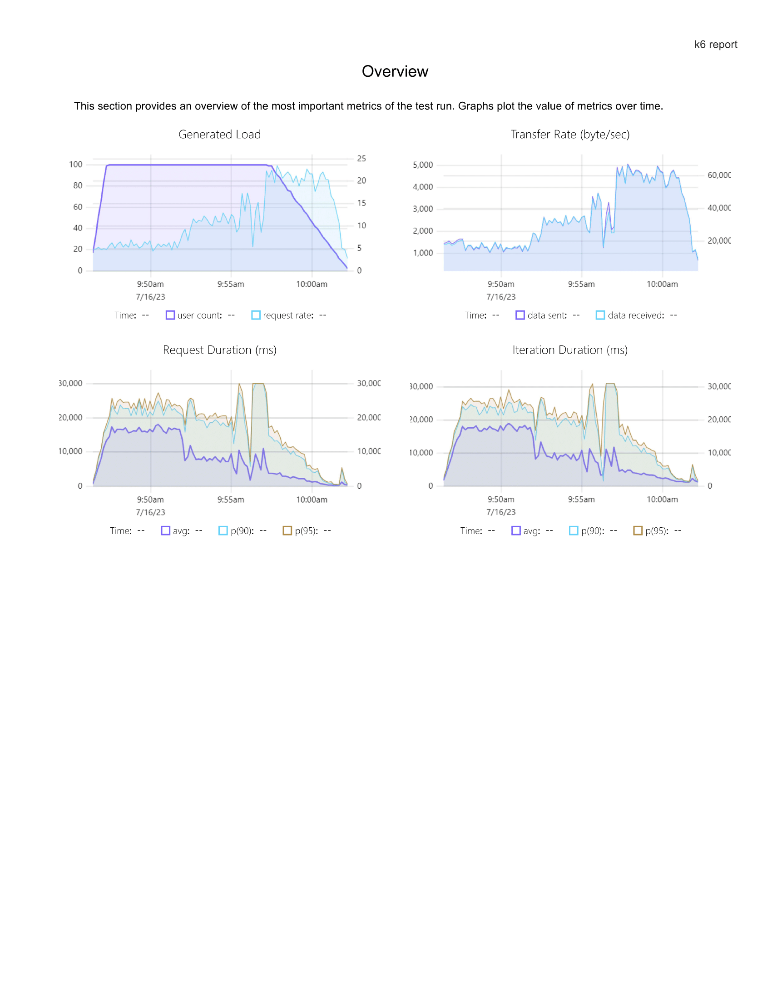
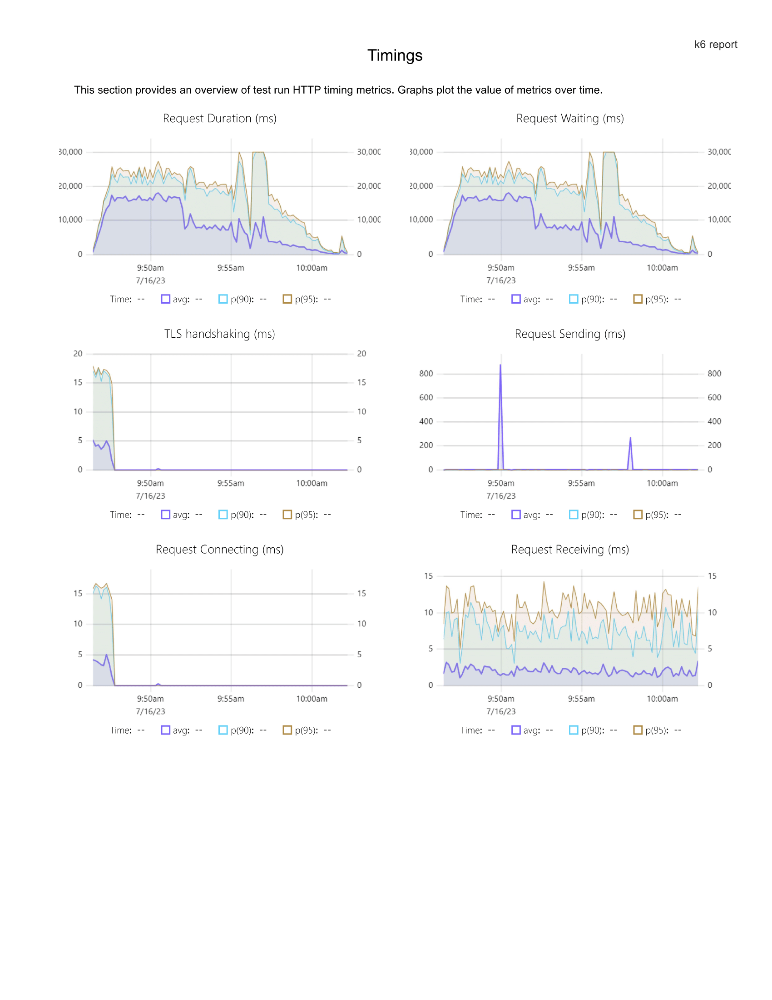
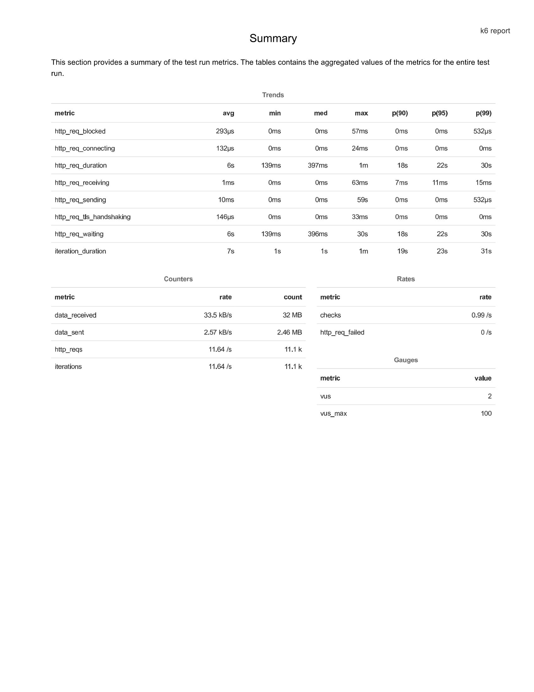

# Záťažové testovanie aplikácie pomocou API

## Spustenie testov
- Na záťažové  testy som použil nástroj K6
- Inštalácia podľa návodu na oficiálnej stránke [K6](https://k6.io/docs/get-started/installation/)
- Spustenie testov

` k6 run .\loadTesty.js`
## Záťažový test Vstupná brána do aplikácie XYA:

-	Aplikácie XYA a Vstupná brána sa nachádzajú na tom istom serveri, preto zámerom perf. testov je zistiť či sa môžu navzájom výkonnostne ovplyvniť.
-	Overiť ako sa bude správať server aplikácie XYA po pridaní novej služby XYA_SignWS_v3 pod očakávanou produkčnou záťažou po nasadení do LIVE.
-	Overiť hardvérovú a softvérovú konfiguráciu systémov.
-	Nájsť slabé miesta systémov a navrhnúť ich optimalizáciu.

## ÚLOHY
1.	Pripraviť si otázky na biznis vlastníka (potenciálne iné zainteresované strany) pre potreby návrhu a vytvorenia záťažového testu.
2.	Navrhnúť záťažový test a návrh testovacieho scriptu.
3.	Ukážka výsledného reportu.

## Odpovede
1. 
- Achitektúra testovanej aplikácie (klient, load balancer, webserver, aplikačný server, DB, atď)
- Používa testovaná aplikácia nejaké programy (aplikácie) tretích strán
- Beží daná aplikácia na on premise serveroch alebo v cloude
- Aký je rozdiel v výpočtovej sile (hardware) medzi testovacím prostredím a produkciou 
- V prípade nedostatočného výkonu CPU, RAM, SSD (HDD) je možnosť zvýšiť výkon serverov
- Z minulých testov sú odhalené nejaké úzke hrdlá aplikácie
- Aké sú očakávané odozvi aplikácie
- Pre koľko užívateľov je aplikácia navrhovaná a kedy sú očakávané najväčšie a najmenšie záťaže.
- Ako často sa pripájajú užívatelia zo zahraničia (môže nastať situácia, že budú blokovaný, timout, atď)
2.
- V dnešnej dobe je veľmi aktuálna téma hypotekárnych úverov, a preto som sa rozhodol vytvoriť testovacie scenáre pre API, ktoré používa
Tatra Banka na výpočet hypotekárnych úverov.
- Testovacie scenáre sú rozdelené podľa veľkosti záťaže: Smoke, Load (priemerná záťaž servera), Stress, Soak, Spike a Breakpoint testy.
- Reálne som spúšťal len Load testy, kde som si stanovil, že v priebehu 10 minút sa pripojí na dané API 100 ľudí (reálne by to mohlo byť omnoho viac,
ale nechcel som sa dostať na blacklist) a budú si chcieť vypočítať svoj hypotekárny úver. Výsledky tohto testu sú zhrnuté v report.pdf. Tento test
si môžete pozrieť v súbore loadTesty.js. V teste som navrhol záťažovú krivku, ktorá pozostáva z lineárneho nábehu užívateľov z 0 na 100 v priebehu
1 minúty, konštantnej časti, kde 100 užívateľov v priebehu 10 minút odosiela requesty a poslednej časti, kde sa užívatelia postupne
odpájajú v priebehu 5 minút. V teste som ďalej overoval aj HTTP statusy 200, veľkosť prijatej správy. Dali by sa urobiť aj iné asserty, ale v tomto 
teste som sa na to nezameriaval. Ostatné testovacie scenáre sú si veľmi podobné líšia sa len záťažovou krivkou. 
- Stress a Spike testy by som ja osobne spúšťal len vtedy ak by som chcel nasimulovať vysoké, nie až tak časté zaťaženie systému.
Napr., ľudia sa dozvedeli v priebehu dňa, že sa budú zvyšovať hypotekárne úroky a v priebehu obedňajšej prestávky si budú chcieť vypočítať
o koľko sa im zvýšia náklady. Pre tento prípad by bolo vhodné použiť Spike testy, kde smernica krivky je veľmi tupý uhol, čo znamená veľmi rýchly
nárast užívateľov za krátky čas. Pri tomto teste sa dá overiť, či jednotlivé systému sú pripravné na enormnú záťaž (load balancery, databázy
web servery, atď...).

3.
- Výsledky Load testov

